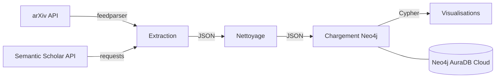

# Analyse de Publications Scientifiques avec Neo4j

> Pipeline Big Data complet pour l'analyse de publications scientifiques arXiv, modélisées en graphe dans Neo4j AuraDB (Cloud).

## Architecture

```
arXiv API & Semantic Scholar API → Python ETL → Neo4j AuraDB (Cloud) → Visualizations (PNG)
```



## Prérequis

- **Docker** & **Docker Compose** installés
- Un compte **Neo4j AuraDB** gratuit : [console.neo4j.io](https://console.neo4j.io)

## Setup

### 1. Obtenir les identifiants Neo4j AuraDB

1. Aller sur [console.neo4j.io](https://console.neo4j.io)
2. Créer une instance **Free**
3. Copier l'URI, le nom d'utilisateur et le mot de passe

### 2. Configurer l'environnement

```bash
cp .env.example .env
# Éditer .env avec vos identifiants Neo4j AuraDB
```

### 3. Lancer le pipeline complet avec Docker

```bash
docker-compose up --build
```

### 4. Lancer une étape spécifique

```bash
# Extraction depuis arXiv uniquement
docker-compose run app python main.py --step extract

# Nettoyage des données
docker-compose run app python main.py --step clean

# Chargement dans Neo4j AuraDB
docker-compose run app python main.py --step load

# Génération des visualisations
docker-compose run app python main.py --step visualize
```

## Modèle de Graphe

```
(:Author)-[:WROTE]->(:Article)-[:HAS_SUBJECT]->(:Subject)
                    (:Article)-[:CITES]->(:Article)
```

| Nœud      | Propriétés                                         |
|-----------|----------------------------------------------------|
| Article   | id, title, year, abstract, url, citation_count     |
| Author    | name                                               |
| Subject   | name                                               |

| Relation     | Propriétés |
|--------------|------------|
| WROTE        | year       |
| HAS_SUBJECT  | —          |
| CITES        | —          |

## Structure du Projet

```
project/
├── README.md
├── requirements.txt
├── .env.example
├── Dockerfile
├── docker-compose.yml
├── config.py
│
├── extraction/
│   ├── __init__.py
│   └── arxiv_extractor.py       # API arXiv uniquement
│
├── cleaning/
│   ├── __init__.py
│   └── cleaner.py
│
├── graph/
│   ├── __init__.py
│   ├── neo4j_connector.py       # Connexion Neo4j AuraDB (cloud)
│   ├── loader.py
│   └── queries.cypher
│
├── visualization/
│   ├── __init__.py
│   └── visualizer.py
│
├── data/
│   ├── raw/                     # Données brutes (JSON)
│   └── cleaned/                 # Données nettoyées (JSON)
│
└── visualizations/              # Graphiques PNG générés
```

## Output — Visualisations

Les fichiers sont sauvegardés dans `./visualizations/` :

| Fichier                       | Description                                  |
|-------------------------------|----------------------------------------------|
| `collaboration_network.png`   | Réseau de collaboration entre auteurs        |
| `citation_network.png`        | Réseau de citations entre articles           |
| `trending_subjects.png`       | Sujets de recherche tendance par année       |
| `top_authors.png`             | Top 15 auteurs les plus prolifiques          |

## Requêtes Cypher Disponibles

Voir [`graph/queries.cypher`](graph/queries.cypher) pour les 10 requêtes d'analyse :

1. Top 10 auteurs les plus prolifiques
2. Top 10 articles les plus cités
3. Réseau de collaboration entre auteurs
4. Sujets tendance par année
5. Articles d'un auteur spécifique
6. Distribution des articles par sujet
7. Auteurs interdisciplinaires (3+ sujets)
8. Année la plus productive
9. **[BONUS] Système de recommandation** (Collaborative Filtering)
10. **[BONUS] Détection de communauté de chercheurs** (Algorithme Louvain via Neo4j GDS)

## Contraintes & Fonctionnalités Implémentées

- ✅ Extraction combinée : **arXiv** (articles) + **Semantic Scholar** (réseau de citations)
- ✅ Implémentation du bonus **Système de recommandation** (Requête 9)
- ✅ Implémentation du bonus **Détection de communauté** (Requête 10 - nécessite GDS)
- ❌ Pas de Neo4j local — **AuraDB cloud URI uniquement**
- ❌ Pas de credentials en dur — toujours depuis `.env`
- ✅ Tout fonctionne via `docker-compose up`
- ✅ Pipeline re-exécutable (`MERGE` empêche les doublons)
- ✅ Les dossiers `data/` et `visualizations/` sont montés comme volumes Docker

## Technologies

| Outil        | Rôle                          |
|--------------|-------------------------------|
| Python 3.11  | Langage principal             |
| feedparser   | Parsing du flux Atom arXiv    |
| pandas       | Manipulation de données       |
| neo4j        | Driver Python officiel        |
| networkx     | Graphes en mémoire            |
| matplotlib   | Visualisations                |
| tqdm         | Barres de progression         |
| loguru       | Logging structuré             |
| Docker       | Conteneurisation              |
